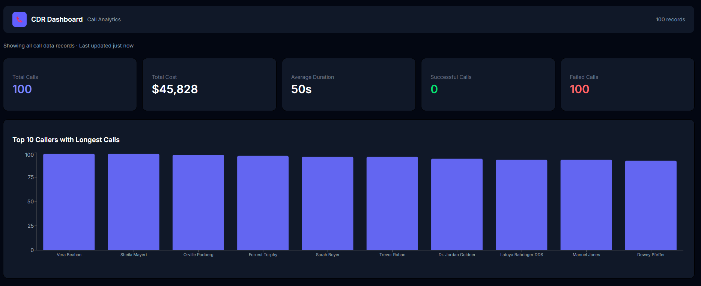
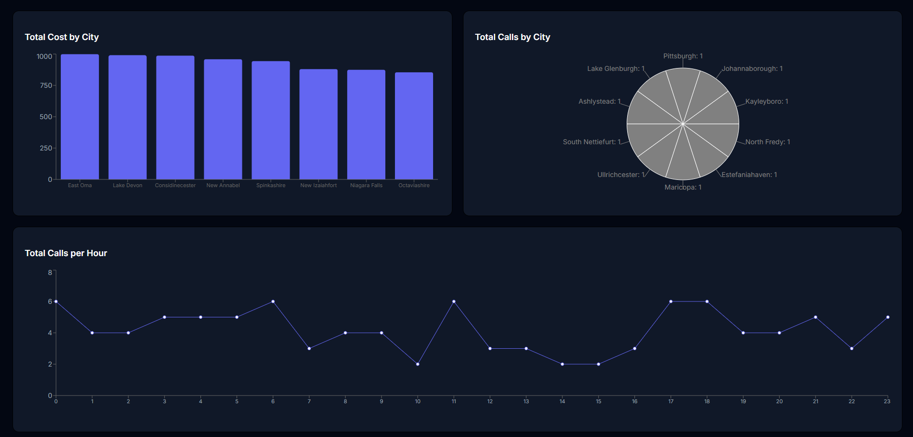
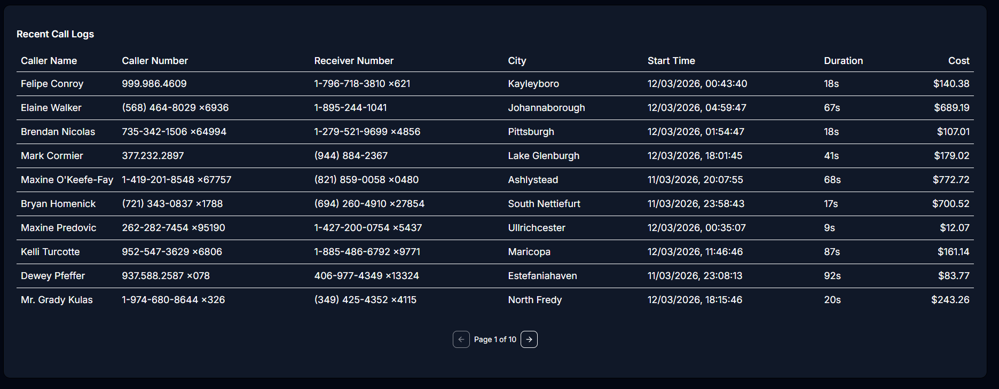

# CDR Dashboard

A Call Data Records (CDR) analytics dashboard built for the London Success Academy Software Development Internship.

## Overview

This dashboard consumes a live CDR API and visualizes call data in a professional SaaS-style interface. It allows telecom teams to monitor call activity, analyze costs, and track performance metrics in real time.

## Features

- KPI summary cards (total calls, cost, duration, success/failure rates)
- Top 10 callers by call duration (bar chart)
- Total cost by city (bar chart)
- Calls by city (pie chart)
- Call activity timeline by hour (line chart)
- Recent call logs table with pagination

## Tech Stack

- React + Vite
- Tailwind CSS
- shadcn/ui
- Recharts

## Getting Started

### Prerequisites
- Node.js v20 or higher

### Installation

```bash
git clone https://github.com/emoulgen2163/cdr-dashboard.git
cd cdr-dashboard
npm install
npm run dev
```

Open http://localhost:5173 in your browser.

## API

Data is fetched from: https://69b30b45e224ec066bdb55a0.mockapi.io/api/v1/cdr

## Deployment

Live dashboard: https://cdr-dashboard-lake.vercel.app/

## Screenshots



